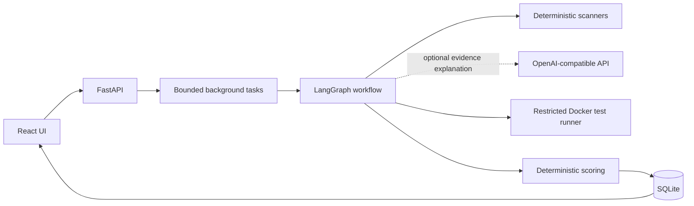
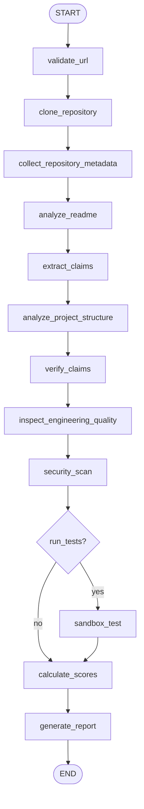

# RepoJudge — GitHub 开源项目验尸官

> 不听 README 怎么说，只看代码能不能跑。

RepoJudge 是一个面向公开 Python 仓库的证据优先审计 Agent。它将 README 中可验证的功能声明转换为规则，在代码、配置、测试和运行日志中寻找证据，并用确定性评分引擎生成可解释报告。未配置大模型时，全部规则分析和 Demo Mode 仍可使用。


## 功能

- 克隆并限制公开 GitHub 仓库的来源、体积、读取大小和分析时间
- 提取并核验 Docker、测试、认证、流式输出、检索、数据库、异步任务等声明
- 检查测试、部署、配置、CI、日志、异常处理、健康检查和类型系统
- 分析包目录、入口文件、依赖文件、测试文件和最大模块体积
- 扫描疑似密钥、私钥、危险执行、弱密码、宽松 CORS 和 Debug 配置
- 可选地在无网络、非 root、限 CPU/内存/PID 的 Docker 容器中运行 pytest
- 输出 README 可信度、生产可用度、学习价值与套壳指数
- 支持专业模式与基于真实证据的毒舌模式
- 内置不依赖 GitHub、LLM 或 Docker 的完整示例报告

## 架构



## Agent 工作流



每个节点位于独立文件。可降级错误会写入 `errors` 并继续；URL 校验或克隆失败等无法继续的错误会让任务以清晰原因结束。工作流没有循环，因此不会产生无限重试。

## 评分

所有评分范围为 0–100，权重在 [`backend/app/core/scoring_rules.py`](backend/app/core/scoring_rules.py) 中公开：

| 分数 | 主要信号 |
|---|---|
| README 可信度 | 声明证据率、README、启动产物、无证据声明 |
| 生产可用度 | 测试、部署、配置、日志、异常、健康检查、CI、类型、安全 |
| 学习价值 | 文档、测试、模块化、规范和可运行性 |
| 套壳指数 | 代码规模、真实工具/数据流程/状态、宣传与实现差距 |

LLM 只能解释有限证据，不能制造证据。预留的语义辅助上限为总分 10%，首版默认评分完全确定性。

## 快速启动

前置条件：Python 3.12+、[uv](https://docs.astral.sh/uv/)、Node.js 22+。

```bash
cp .env.example .env
uv sync
cd frontend && npm install && cd ..
```

终端一：

```bash
PYTHONPATH=backend uv run uvicorn app.main:app --reload
```

终端二：

```bash
cd frontend
npm run dev
```

打开 <http://localhost:5173>。点击“查看完整示例报告”可在无网络、无 API Key、无 Docker 时体验完整 UI。

## 环境变量

| 变量 | 默认值 | 说明 |
|---|---|---|
| `DATABASE_URL` | `sqlite:///./repojudge.db` | SQLAlchemy 数据库 URL |
| `LLM_BASE_URL` | 空 | OpenAI-compatible API 根地址 |
| `LLM_API_KEY` | 空 | API Key；不会写入数据库或日志 |
| `LLM_MODEL` | 空 | 模型名 |
| `CORS_ORIGINS` | `http://localhost:5173` | 逗号分隔的可信来源 |
| `MAX_CONCURRENT_AUDITS` | `2` | 同时分析任务上限 |
| `MAX_QUEUED_AUDITS` | `20` | pending/running 任务总上限 |
| `MAX_REPOSITORY_MB` | `100` | 单仓库上限 |
| `MAX_REPOSITORY_FILES` | `20000` | 单仓库文件数量上限 |
| `CLONE_TIMEOUT_SECONDS` | `120` | 克隆超时 |
| `ANALYSIS_TIMEOUT_SECONDS` | `600` | 总分析期限 |
| `MAX_FILE_BYTES` | `524288` | 单文件读取上限 |
| `SANDBOX_TIMEOUT_SECONDS` | `300` | 沙箱测试超时 |
| `SANDBOX_IMAGE` | `repojudge-sandbox:py312-v1` | 可信 pytest 沙箱基础镜像 |

未配置三个 LLM 变量时，报告明确显示“LLM 语义核验未启用”。

## Docker

```bash
cp .env.example .env
docker compose up --build
```

前端位于 <http://localhost:3000>，API 文档位于 <http://localhost:8000/docs>。

宿主 Docker socket **不会**挂入应用容器。若要从容器化后端执行目标仓库测试，需要单独设计隔离执行基础设施；默认 Compose 部署会安全降级为 `skipped`。

宿主机开发模式首次执行沙箱测试时会自动构建项目自带的可信基础镜像，也可以提前执行：

```bash
make sandbox-image
```

目标仓库依赖仅以离线模式安装；测试容器始终使用 `--network none`。基础镜像中不存在的依赖会让测试明确失败，不会临时开放网络。

## API

```bash
curl -X POST http://localhost:8000/api/v1/audits \
  -H 'Content-Type: application/json' \
  -d '{"repository_url":"https://github.com/owner/repo","mode":"professional","run_tests":false}'
```

```text
POST /api/v1/audits
GET  /api/v1/audits/{task_id}
GET  /api/v1/audits/{task_id}/report
GET  /api/v1/audits/{task_id}/report/markdown
GET  /api/v1/demo
GET  /health
```

示例产物见 [`examples/sample_report.json`](examples/sample_report.json) 与 [`examples/sample_report.md`](examples/sample_report.md)。

## 本地质量检查

```bash
uv run pytest
uv run ruff check .
uv run mypy backend/app
cd frontend && npm run build
```

测试使用本地 fixture 和 FakeLLM，不依赖真实 GitHub 或模型服务。

## 安全说明

分析陌生仓库始终存在风险。Docker 沙箱只能降低风险，不能保证绝对安全。RepoJudge 默认不执行目标代码；仅在用户明确选择后尝试沙箱测试，并使用：

- 默认禁止网络、非 root、只读仓库挂载
- CPU、内存、PID 和超时限制
- `no-new-privileges`、删除 Linux capabilities、禁止 privileged
- 不挂载 Docker socket，运行后自动删除容器
- 外部命令使用参数数组，应用代码不使用 `shell=True`

轻量安全扫描会误报或漏报，不替代专业人工审计。疑似密钥在证据和日志中会脱敏。

## 当前限制

- 首版仅针对 Python 项目
- README 提取以关键词和有限规则为主，复杂自然语言可能漏检
- GitHub Token 通过临时 Git HTTP header 传递，不嵌入 URL、不持久化；私有仓库不在首版范围
- 沙箱只允许离线依赖安装，因此基础镜像中不存在的依赖会让陌生项目测试失败
- 规则扫描不是 AST 级 SAST，也不分析完整依赖漏洞数据库
- SQLite 与进程内后台任务适合演示和单实例，不适合水平扩展

## Roadmap

- AST/调用图与覆盖率证据
- 预构建离线依赖镜像和远程隔离执行器
- GitHub API 元数据与 commit 固定
- JavaScript/TypeScript、Go 与 Rust 分析器
- SARIF、PDF 和可分享报告
- PostgreSQL 与持久任务队列

## 贡献

1. Fork 并创建特性分支。
2. 新规则必须提供确定性测试和误报说明。
3. 执行后端测试、Ruff、mypy 与前端构建。
4. 提交 PR，并避免加入任何真实密钥或未经授权的仓库内容。

开发约束见 [`AGENTS.md`](AGENTS.md)。

## License

[MIT](LICENSE)
